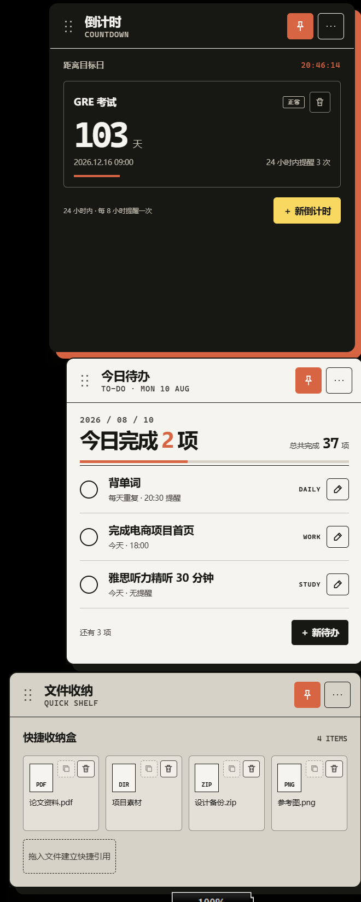
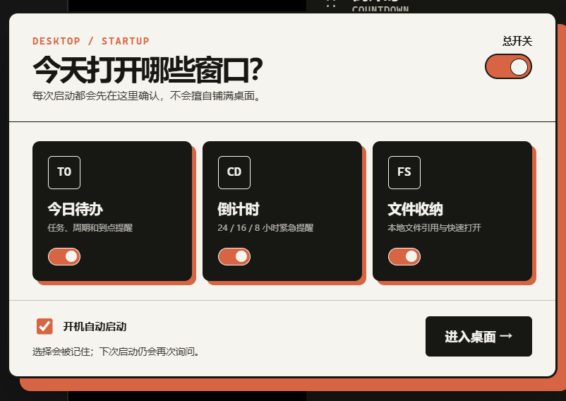

# DeskFlow · 序 · 桌面效率工具



> 三个住在你桌面上的小卡片。
> 一个钉住拖延,一个盯着 Deadline,一个把杂物码得整整齐齐。

**序** 是一套 Windows 桌面悬浮组件,长得像从纸里剪出来的三张卡片,但它们是真的会干活:

- **今日待办** — 你的每日任务清单。勾掉一项会蹦粒子庆祝;没做完?它比你更着急。
- **倒计时** — 给重要日子上发条。24 / 16 / 8 小时三档紧急提醒,越接近 Deadline 它越红。
- **文件收纳** — 把文件拖到卡片上,它就记住位置。下次想找,点一下,文件自己打开。

每个模块都是一个**钉在桌面上的独立透明小窗口**:位于壁纸和图标之上、所有程序窗口之下——开程序、拖文件,它们都乖乖贴在桌面给你看着。可以拖、可以缩放、可以折叠成三层书页塞到角落;位置和尺寸都会被记住,下次启动原位回来。

<p align="center">
  
</p>

## 为什么是这个样子

界面是一份单文件 HTML(`desktop-organizer-concepts/index.html`),带完整的设计系统:纸质感配色、硬阴影、折页动画、粒子特效。外壳(v3,C# WinForms + WebView2)只负责把每个模块变成一个真正的 Windows 窗口 —— 桌面钉住、拖动、缩放、托盘、开机自启,都是原生能力,整个程序只有 ~4MB。

## 目录

- `desktop-organizer-app/` — v1 外壳(PySide6,已退役)
- `deskflow-v2/` — v2 外壳(Python + WebView2,已退役)
- `deskflow-v3/` — **v3 外壳(C#,当前版本)**:源码、构建脚本、图标
- `desktop-organizer-concepts/` — 界面层(HTML + 概念渲染脚本)
- `docs/images/` — README 展示图

## 构建

```powershell
cd deskflow-v3
.\build.ps1
```

产物在 `deskflow-v3\dist\DeskFlow\`,整个目录 ~4MB:一个 3.4MB 的 exe + WebView2 加载器 + 界面 HTML。需要系统装有 WebView2 Runtime(Win11 自带)。

## 使用

- 双击 exe,首次启动弹设置面板,拨动开关,勾哪个,哪个就上桌
- 组件默认**钉在桌面上**:位于壁纸和图标之上、所有程序窗口之下,开程序/拖文件都会盖在它上面(Win+D 显示桌面时也一直在)
- 拖标题栏移动,拖边缘缩放;位置和尺寸自动记忆,下次启动原位恢复
- 标题栏图钉按钮 = 桌面固定开关(默认开);关掉后是普通浮动窗口
- 右上角菜单可折叠 / 紧凑 / 回原位 / 打开设置
- 设置面板右上角 ✕ 或 Esc 关闭（不点「进入桌面」就不会改动组件）
- 托盘图标常驻:「设置…」开关模块和开机自启,「彻底退出」
- 数据存在 `%APPDATA%\DeskFlow`

## 修复记录

- 2026-08-13:修复手动尺寸模式下嵌入窗口内三个页面全部堆叠渲染(CSS 优先级 bug,`.widget:not(.module-off)`)
- 2026-09-04:v3 设置窗口上线 —— 用 HTML 启动器面板(总开关 + 三模块开关 + 开机自启)替换 WinForms 启动对话框,托盘「设置…」/ 组件菜单「窗口总开关…」/ 双击托盘均可打开
- 2026-09-04:修复 v3 桥接参数丢失(JavaScriptSerializer 把嵌套数组反序列化为 `Collection<object>`,`is object[]` 判断失败导致 resizeWindow / setEnabledModules / copyFiles 全部按空参数执行)
- 2026-09-04:修复 v3 从设置/托盘关闭模块时窗口不隐藏(`TryGetValue` 只在 visible 分支执行,移植自 v2 时引入)
- 2026-09-04:启动黑框与三页面黑边的根因是 v2 —— python.exe 控制台宿主 + `WS_EX_NOREDIRECTIONBITMAP` 在窗口显示后才设置且未生效;v3(CreateParams 提前设置 + GUI 子系统)两者皆无,v2 自启命令也已改用 pythonw.exe 兜底
- 2026-09-04:**桌面钉住模式** —— 组件窗口 SetParent 到桌面层(Progman,失败时发 0x052C 生成 WorkerW,每进程只试一次),默认开启、状态持久化;原「置顶窗口」图钉按钮语义改为「桌面固定」;explorer 重启后自动重挂
- 2026-09-05:桌面钉住改用 z 序方案(SetParent 会让 WebView2 走子窗口渲染路径、alpha 失效发黑),并修复 `GetWindowW` 入口点崩溃
- 2026-09-05:程序图标 —— 「序」纸片卡片(墨色圆角底 + 珊瑚橙硬阴影),嵌入 exe 并用于托盘/Alt-Tab
- 2026-09-05:文件收纳文件名过长时在卡片内两行换行、超出省略号截断(原单行 nowrap 会溢出卡片压到相邻卡片),悬停显示完整文件名

## 许可

MIT
